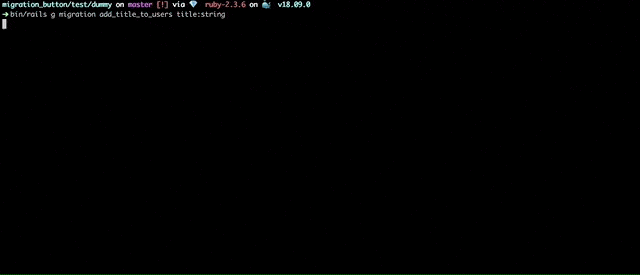

# MigrationButton

Rails engine for running migrations via browser.



## Installation
Add this line to your application's Gemfile:

```ruby
gem 'migration_button', github: 'asok/migration_button'
```

And then execute:
```bash
$ bundle
```

Set `:migration_button` in `config/environments/development.rb` like so:
```ruby
config.active_record.migration_error = :migration_button
```

Now if there are pending migrations you will be presented with the page for running them. You can always visit this page under [http://localhost:3000/__migration_button](http://localhost:3000/__migration_button).

## Contributing

Clone the repo.

Install the dependencies with:
```bash
$ bundle
```

Run the tests with:
```bash
$ MIGRATION_BUTTON=1 bundle exec rails test
```

Develop -> commit -> make a pull request :sunglasses:


## License
The gem is available as open source under the terms of the [MIT License](https://opensource.org/licenses/MIT).
